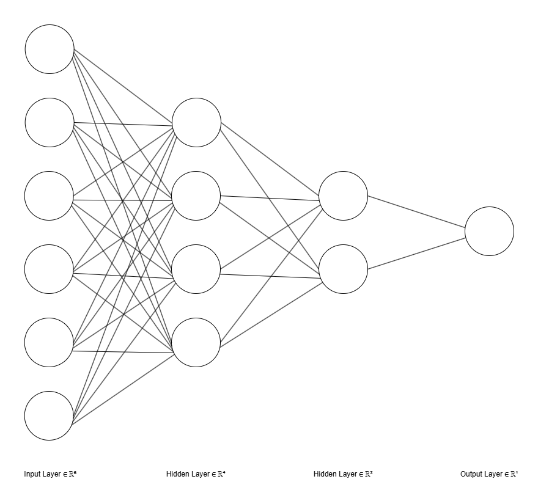

## ✍️ Texture-Driven Siamese Networks with Vision Transformers for Offline Writer	Verification 

This repository presents a writer verification system that compares handwritten samples to determine if they originate from the same writer. The verification process relies on texture images generated from handwritten documents, where white spaces between lines and words are minimized to better capture stylistic characteristics. The system operates in a text-independent, offline setting and supports binary classification.

This is my main contribution to the final year research project titled **Exam Candidate Verification Through Handwritten Artifacts**, available [here](https://github.com/hasathcharu/exam-candidate-verification). I was responsible for designing and developing Module 2 – Quick Writer Verification with Automatic Feature Extraction.

### 🔧 System Overview
This system verifies whether two handwriting samples originate from the same writer or not, even under variations such as writing speed.
There are 2 modes supported in this system.
- Standard mode verification - One sample per writer 
- Two-speed mode verification - Uses both normal and fast handwriting to handle intra-writer variability.

### 🛠️ Key Features
#### Texture-based Representation
Developed a pipeline to convert handwritten documents into compact texture images by minimizing irrelevant white spaces. This approach was inspired by prior works, *Writer Verification Using Texture-Based Features* by Hanusiak et al. and *Personal Identification Based on Handwriting* by Said et al.

The input to this pipeline is a line-removed, binarized handwriting sample. First, lines are segmented using horizontal projection, and then words are segmented using vertical projection. The detected words are placed onto a new canvas while reducing gaps between lines and words. This results in a compact visual representation of the handwriting. Finally, the texture image is split into patches. The pipeline is illustrated below.

  

#### Siamese Network Architecture
The verification framework is built on a Siamese neural network, which is designed to learn and compare feature representations of two inputs. In our case, the Siamese network compares feature embeddings of two handwriting texture patches to determine whether they originate from the same writer. To extract these features, several pretrained models were evaluated, including VGG16, ResNet18, ResNet50, ViT224, and ViT384. These models were fine-tuned on our dataset, and ViT384 was selected for its superior performance.

A projection head consisting of three dense layers was added, with output dimensions of 512, 256, and 128 respectively. Each dense layer is followed by Layer Normalization and the GELU activation function. The output is then L2-normalized. The resulting embeddings are compared using Euclidean distance, a lower distance means the samples are likely from the same writer and a higher distance means they are likely from different writers.

  

##### Standard Mode of Verification
In the standard verification mode, the system is designed to operate under the constraint of having only one handwriting sample per writer. To enhance the robustness of verification during inference, from each handwriting sample, four textures are generated. Each texture is independently passed through the feature extractor and projection head to obtain a feature embedding, as described in the architecture shown above. These embeddings are then averaged to form a single representative embedding for that document. The final verification decision is made by computing the Euclidean distance between the averaged embeddings of the two samples. This distance score is then thresholded to determine whether the samples originate from the same writer.

##### Two-speed Mode of Verification
In the two-speed mode, there should be two handwriting samples per writer, one written at a normal speed and the other at a fast speed, which results in four documents per verification instance. Similar to the standard verification mode, four textures are generated per document, feature embeddings are computed, and the embeddings are averaged to produce a single representation for each document. From these averaged embeddings, six pairwise comparisons are made:
- Two intra-writer comparisons - normal vs. fast samples from the same writer.
- Four inter-writer comparisons - cross comparisons between known and questioned samples across speeds.

Each pair is processed by the Siamese network, the same architecture that was used in standard mode of verification to produce a dissimilarity score. These six scores are then passed into a feedforward neural network which produces the final verification decision. This allows the model to exploit variability patterns rather than relying solely on static visual features. The architecture of this mode is presented below.

  

The feedforward neural network consists of three fully connected layers with ReLU activations applied to the first two layers. The architecture is presented below. The final output is a single logit value representing the dissimilarity score between the two sets of handwriting samples. A sigmoid activation is applied during inference to obtain a probability score. This neural network was trained using the same writers that was used to finetune the feature extractors.

  

### 📊 Evaluation
#### 🗂️ Datasets Used
Three datasets were used for training and evaluation:
- Private Dataset: 600 samples from 100 writers.
- CVL Dataset: 1,597 samples from 309 writers.
- IAM Dataset: 1,539 samples from 657 writers (used only for testing to evaluate generalization).

For the Private and CVL datasets, 70% of writers were used for training. The remaining 30% were split evenly between validation and testing. No writer overlap was allowed across splits.

#### 🧼 Data Preparation
Each handwriting sample underwent preprocessing, which included rule line removal (when applicable), binarization, and texture generation. After that, each sample was converted into multiple texture patches. For training and fine tuning the networks, genuine and imposter pairwise combinations were created. To maintain class balance, an equal number of impostor pairs were randomly sampled to match the number of genuine pairs.

#### 🧪 Approaches Evaluated
| Approach | Description |
|----------|----------|
| standard_texture | Uses a single texture representation from standard-speed handwriting per writer. | 
| standard_sample | Uses full documents at standard speed, represented by the average of 4 texture patches.|
| two_speed_texture | Uses one texture representation from both normal-speed and fast-speed handwriting per writer. | 
| two_speed_sample | Uses separate documents for normal and fast speeds, each represented by the average of 4 textures.|

Note: Only the private dataset supports speed-level data.

#### 📈 Results
| Approach | Dataset | Feature Extractor | Accuracy | AUC | Precision | Recall | F1-score | EER | FAR | FRR |
|----------|---------|-------------------|----------|-----|-----------|--------|----------|-----|-----|-----|
|standard_texture| Private+CVL | ResNet18 | 81.57% | 89.59% | 81.21% | 82.16% | 81.68% | 18.36% | 17.84% | 19.04% |
|standard_texture| Private+CVL | ViT224 | 84.97% | 91.99% | 83.79% | 86.71% | 85.23% | 15.10% | 13.29% | 16.77% |
|standard_texture| Private+CVL | VGG16 | 86.66% | 94.07% | 85.17% | 88.77% | 86.94% | 13.06% | 11.23% | 15.45% |
|standard_texture| Private+CVL | ViT384 | 87.96% | 94.81% | 87.28% | 88.87% | 88.07% | 12.00% | 11.13% | 12.95% |
|standard_texture| Private | ViT384 | 80.21% | 88.83% | 76.93% | 86.29% | 81.34% | 19.06% | 14.96% | 24.21%|
|standard_texture| IAM  | ViT384 | 87.89% | 94.84% | 88.65% | 86.91% | 87.77% | 12.22% | 13.09% | 11.12%|
|standard_sample| Private | ViT384 | 86.89% | 93.47% | 89.15% | 84.00% | 86.50% | 13.11% | 16.00% | 10.22% |
|standard_sample| CVL | ViT384 | 92.41% | 98.10% | 95.80% | 88.72% | 92.12% | 7.20% | 11.28% | 3.89%|
|standard_sample| IAM | ViT384 | 90.69% | 97.64% | 97.14% | 83.85% | 90.01% | 7.22% | 16.15% | 2.47%|
|two_speed_texture| Private | ViT384 | 89.33% | 95.56% | 88.56% | 90.33% | 89.44% | 10.50% | 9.67% | 11.67%|
|two_speed_sample| Private | ViT384 | 95.33% | 98.71% | 98.82% | 91.76% | 95.16% | 6.04% | 8.24% | 1.10%|
